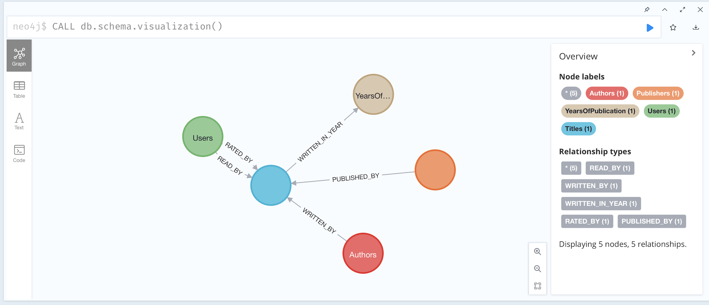
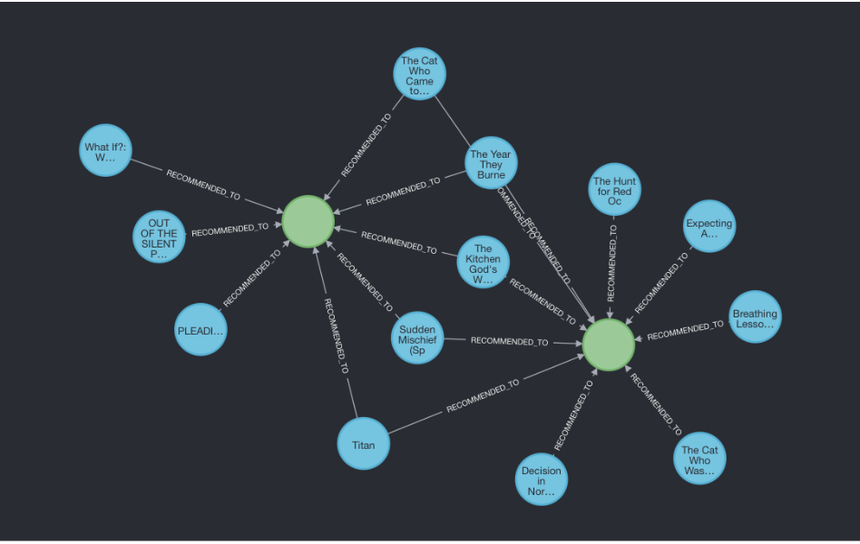
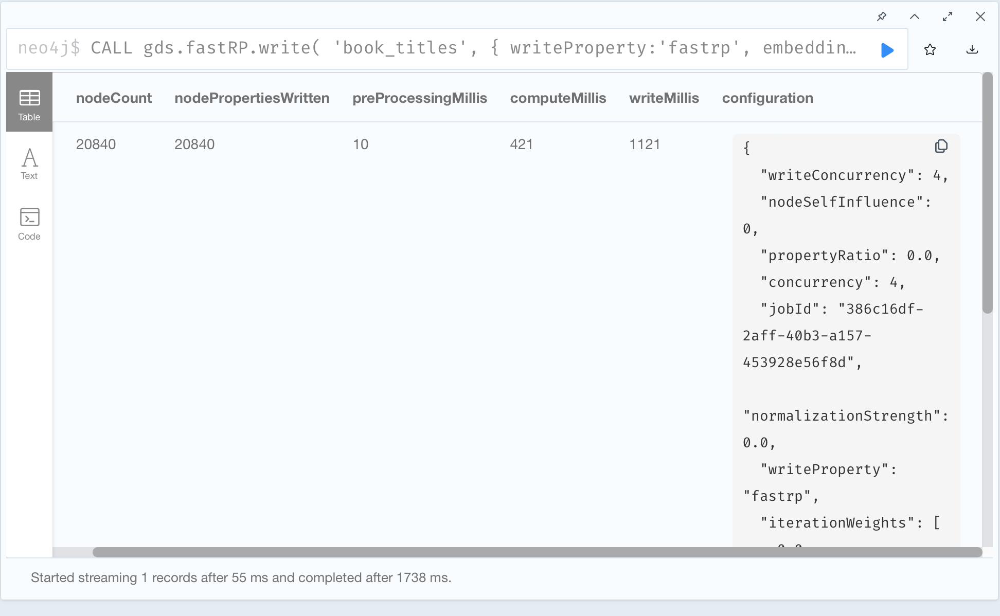
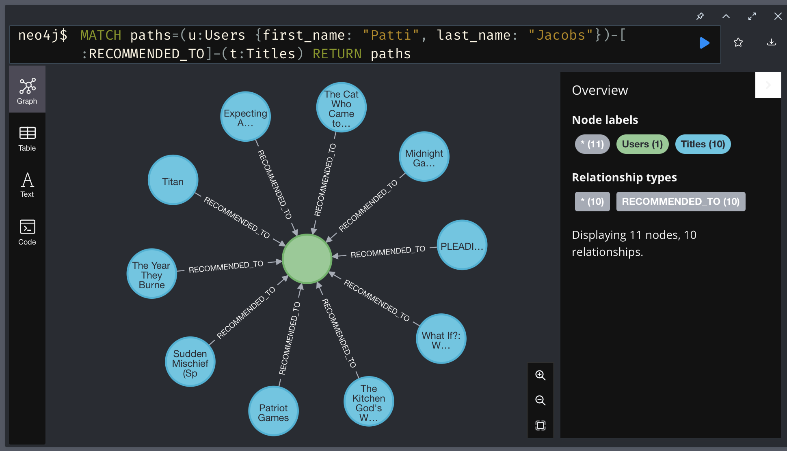
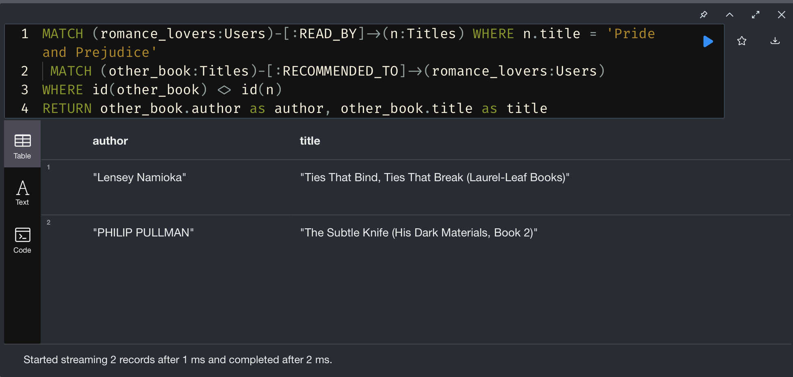
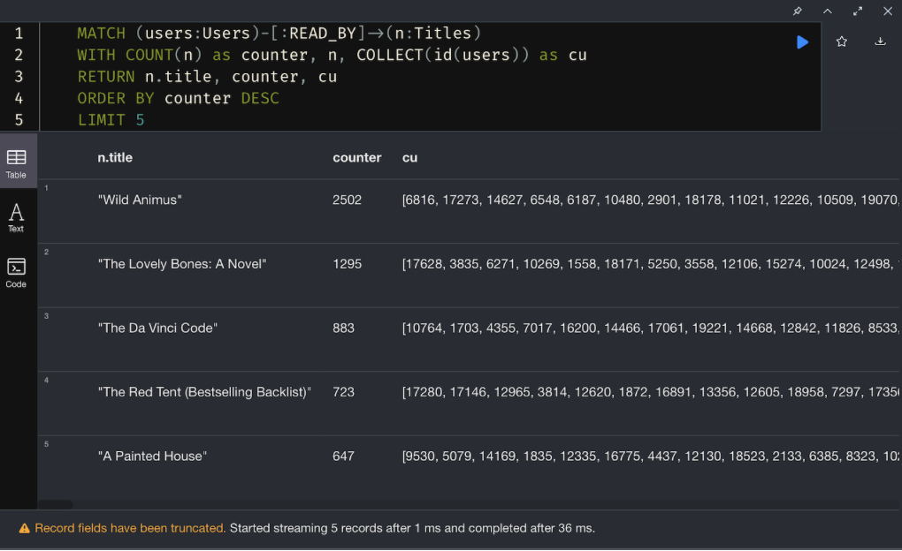
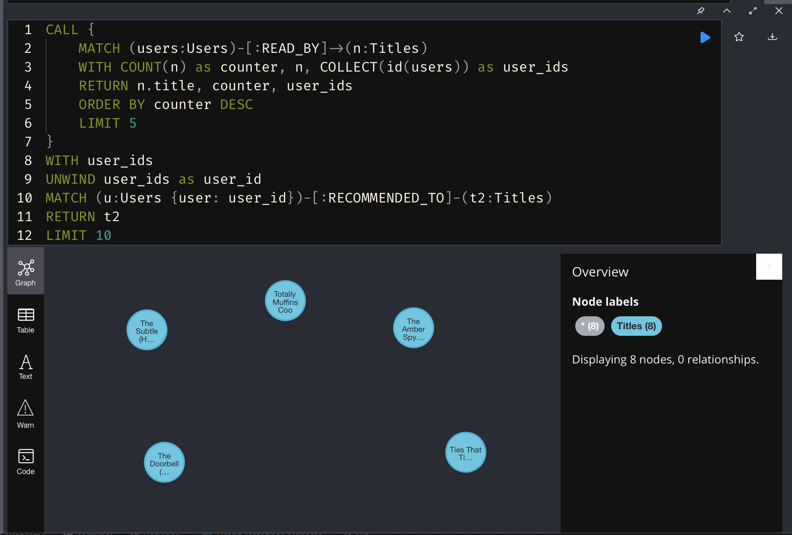
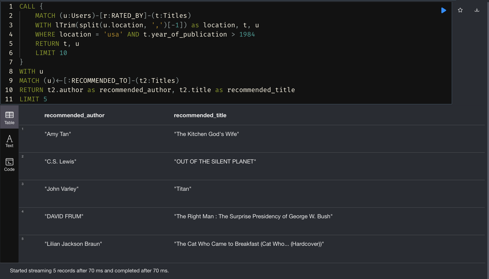

# Graph ML on PyTorch Geometric in Neo4j

[PyTorch Geometric](https://pytorch-geometric.readthedocs.io/en/latest/) is a Python library for dealing with graph algorithms.

## Installation

Use the package manager [poetry](https://python-poetry.org/) in myenv to install foobar. Install [pyenv](https://github.com/pyenv/pyenv) befrorehand.

```bash
python3 -m venv .venv
source .venv/bin/activate
pip3 install poetry --no-cache   
poetry install
```

Now build desired `neo4j` container.
```dockerfile
CONTAINER=$(docker run -d \
    -p 7474:7474 -p 7687:7687 \
    -v $(pwd)/data/neo4j_db/data:/data \
	-v $(pwd)/data/neo4j_db/logs:/logs \
	-v $(pwd)/data/neo4j_db/import:/var/lib/neo4j/import \
    --name test-neo4j-stx-books-recommender44 \
    -e NEO4J_apoc_export_file_enabled=true \
    -e NEO4J_apoc_import_file_enabled=true \
    -e NEO4J_apoc_import_file_use__neo4j__config=true \
    -e NEO4J_AUTH=neo4j/stx_books_pass \
	-e NEO4JLABS_PLUGINS='["apoc", "graph-data-science"]' \
	-e NEO4J_ACCEPT_LICENSE_AGREEMENT=yes \
	neo4j:4.4-enterprise
)                  
```

Of note: We use here 4.4 version due not stable (at 30.01) APOC version from 5.x. This might very in future.

### Setup
Once Docker Container is up and running, create contents based on queries in `YOUR_DOCKER_NEO_LOCATION/db_loader.cypher` file.
You have few options:
1. _(Easy-mode)_ You can run them in [browser](http://localhost:7474/browser) and just copy-paste.
2. Within terminal run ->

`$ docker exec $CONTAINER /var/lib/neo4j/bin/neo4j-shell -f YOUR_DOCKER_NEO_LOCATION/db_loader.cypher`

or for interactive mode... (to copy-paste like in browser)

`$ docker exec -ti $CONTAINER /var/lib/neo4j/bin/neo4j-shell`

#### Important! (ML Flow setup)

Prior running your code you need to define all variables stored in `.env`.

Especially:
```commandline
MLFLOW_USER=
MLFLOW_PASSWORD=
MLFLOW_URL=
```

So either use your own **MLFlow** account or use own dockerized one.

---
### Data schema
After proper data population within graph database there should be visible following schema:

Or you can try by yourself by calling 
```cypher 
CALL db.schema.visualization()
```
#### So we have following:
* **Users** - representing our users with some attributes (including `first_name`, `last_name` etc)
* **Titles** - representing specific books with their metadata. Connected with user with relations `RATED_BY` and `READ_BY`. While `RATED_BY` has its wage (0-10) and its used for further embeedings via FastRB to classify and obtain our recommendations (that will be modelled via `RECOMMENDED_BY`)
* **Authors** - Node that points to given Author of book, with its metadata. By relation `WRITTEN_BY`
* **YearsOfPublications** - node for specific year of publication (via `WRITTEN_IN_YEAR` relation)
* **Publishers** - node representing publisher of given book (via `PUBLISHED_BY` relation)


More detailed schema (with specific indicies in `csv` view) can be read [here](assets/full_schema_prior_mapping.csv) 

### Running
Then run following code in the terminal for training model and creating a new `RECOMMENDED_TO` relationship. 

```bash
python3 main.py
```


Obviously the relation is between `Titles` and `Users`
`(Titles)-[:RECOMMENDED_TO)->(Users)`

Below a fracture of new relationships:


How the process of embeedings (to temporary `book_titles` graph) look like:



---

## Results (see also our blog-post*)

**temp ->** [link to STX blogpost here](https://docs.google.com/document/d/1AJ7Gm_Lc-wcRb_IXm1GvShT6c2yQ8Q0csD_6vLwYDLA/edit#) for more (TODO: or copy-paste here)

Graph-based recommendation give us *very powerful* tool to search by different criteria. Where our imagination is the limit.

* Finding recommendations based on User criteria

Results of recommendation for specific user (in this case Patti Jacobs)


* Overlapping sets 

List of readers that loves *"pride & prejustice"* to check what do they have in common:

For [results CSV](assets/pride_recommendations.csv) 


* Recommendations based on popularity

What are the best guesses for top-5 books readers.
Below the cypher sub-query obtaining first part 


Full query showing all recommendations

For [results CSV](assets/most_popular_books_by_reads.csv)


* Recommendation on any criteria

Here make limitation to only readers based on `US` that have already rated books published after `1984` !


For [results CSV](assets/recommended_after_84.csv)


## Next steps
Pulling data from Neo4j and loading results to Neo4j are made with the use of `["graph-data-science", "apoc"]` plugins.

For a visualisation - an example of new mapping can be found in `sample/results.txt` file, but it is not updated after new training.

## Contributing

Pull requests are welcome. For major changes, please open an issue first
to discuss what you would like to change.

Please make sure to update tests as appropriate.

## Credits
* [Bartosz Mielczarek](https://www.linkedin.com/in/bartosz-mielczarek-647346117)
* [Piotr Walkowski](https://www.linkedin.com/in/piotrwalkowski/)


## License

[MIT](https://choosealicense.com/licenses/mit/)